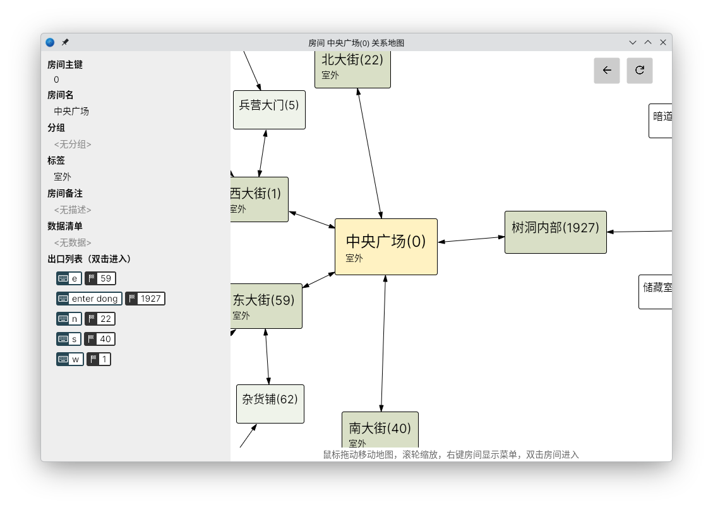
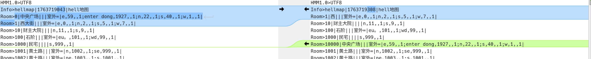
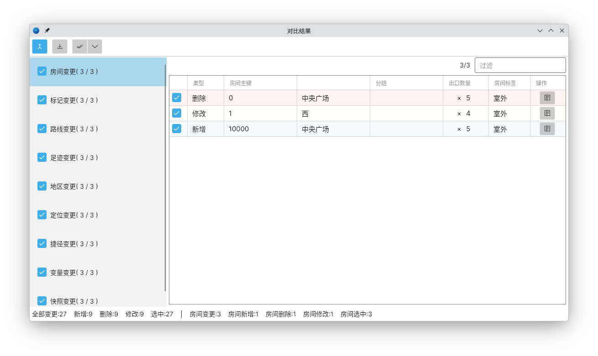

# HellMapManager
HellMapManager(HMM)是一款专注于MUD游戏地图数据维护和管理的跨平台工具。HellMapManager的特点包括

* 跨平台(Windows/Linux/Mac)支持
* 针对房间/标记/路线/足迹/地区/定位/捷径/变量/快照等常见数据结构的支持
* 可视化的房间关系图
* 支持高人类可读性、代码管理优化的纯文本格式地图和压缩格式地图
* 支持UTF8/GB18030两种编码的维护
* 支持地图文件的对比功能，能将地图文件的变更导出为补丁文件。支持选择性的合并地图文件的差异/补丁
* 有配套的Typescript/Javascript/Lua脚本支持
* 提供基于HTTP和JSON的通用接口
* 完善的文档支持

## 跨平台

得益于C# dotnet平台和Avalonia UI优秀跨平台性能，HMM支持以下平台

* Linux平台:支持当前和上一个版本的Debian发行版及对应内核/Glibc的发行版
* Windows 平台: Windows 10/Windows 11
* Mac OS X:最新2个大版本的实验性支持

*Mac OS X版本由于用户数量和苹果较为激进的更新策略，不能保证稳定性。*

## 丰富的数据结构

HMM包含有对以下数据结构的支持

* 房间
* 标记
* 路线
* 足迹
* 地区
* 定位
* 捷径
* 变量
* 快照

[详细概念](doc/term/index.md)

## 可视化 关系地图

提供可视化的，可浏览的关系地图，便于探索地图数据。

## 便于使用的文件格式

HMM使用基于CSV变种的HMM格式文件，便于阅读，以行为单位，也能在GIT等代码软件里很容易的观察出变动内容。

*对于空间敏感型场合，HMM支持基于zip的打包2进制格式.hmz*

[文件格式参考](doc/format/hmm.md)

## UTF8/GB18030支持

由于中文MUD的编码，现存MUD客户端软件的现状，HMM支持维护UTF8和GBK18030两种编码的地图文件，便于在不同的客户端中直接使用。

## 对比/补丁文件

作为专业的地图数据维护工具，HMM支持对地图文件进行对比，查看数据中更改过的地方，选择性的合并数据，并能将变更内容到处为.hmp补丁文件。

## HTTP接口支持

只要您使用的MUD客户端支持 JSON和HTTP,您就能通过HTTP的方式使用 HMM的完整功能，[查看接口说明](./doc/api/index.md)

## 完善文档

HMM提供完善的文档支持，[进入文档](doc/index.md)。

