# 教程：使用HellMapManager手动绘制地图

这篇教程会简单的介绍通过HellMapManager的程序界面手动绘制一个区域的地图的过程。

## 准备工作

* 下载最新的HMM软件
* 新建一个新的HMM文件，保存为你的脚本能使用的编码(UTF8/GB18030)。如果准备以接口形式调用地图，可以保存为UTF*格式
* 确定你要绘制地图的区域和起始位置。在这篇教程里选择的是某个MUD的佛山作为目标，大镇街作为起点。
  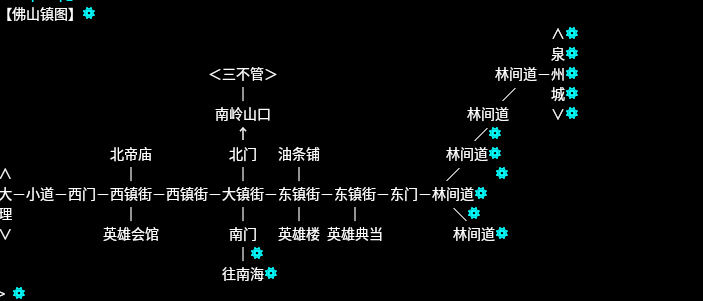
* 打开你的客户端，进入你的角色，前往对应位置。

## 绘制起点房间

首先，在客户端里看一下当前房间的信息

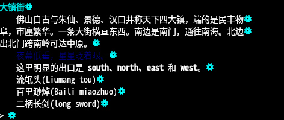

然后，我们在hmm里点检房间，然后点击左上角的添加房间按钮。

在弹出的新建窗口里，输入如下信息

* 主键: foshan-dazhenjie
* 名称: 大镇街
* 分组: 佛山
* 出口:
  * 目标:???? 指令 n
  * 目标:???? 指令 e
  * 目标:???? 指令 s
  * 目标:???? 指令 e
* 描述： Landmark 大镇街

结果如图

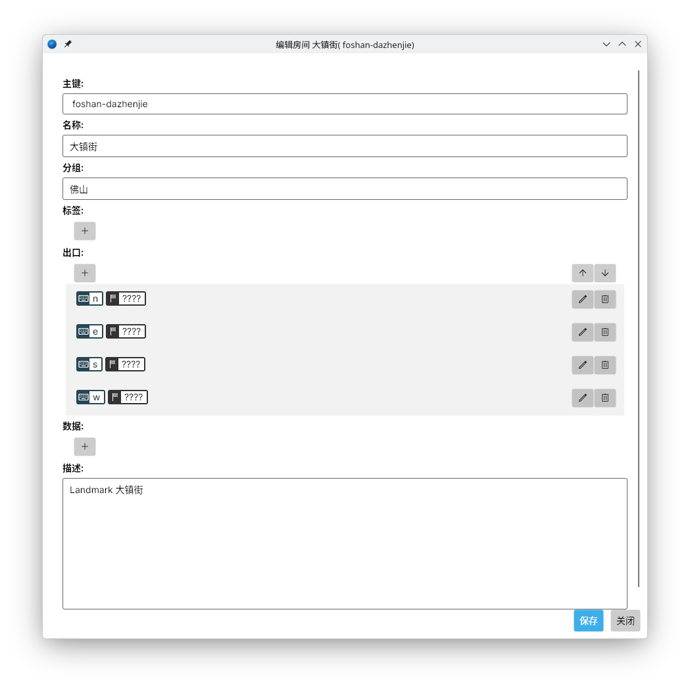

解释：

* 主键设置为不带业务数据的值。为了防止编码问题，建议使用字母数字的组合。
* 名称一般就是房间名，便于管理。
* 分组就是房间的地区。
* 出口 的目标由于都不知道对应房间的信息，先都设为????，便于之后查遗补缺。
* 描述是觉得这个房间可能可以用来定位，先标记下。
  
添加结束后，应该在房间列表中出现一个单独的房间，如下图

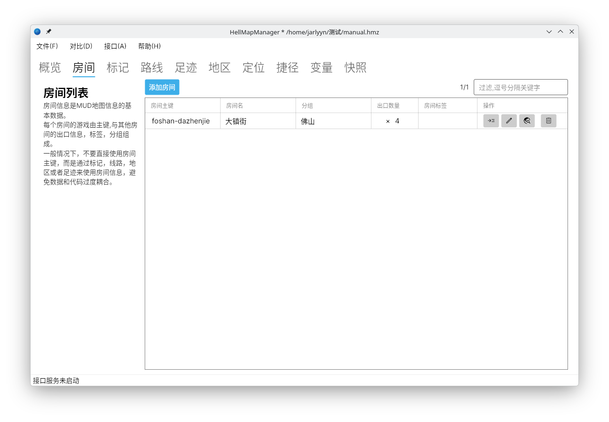

## 进入房间关系地图

在列表里，我们点击大镇街这个房间 操作这一栏里的查看房间关系地图按钮。

点击之后，会出现一个地图关系地图

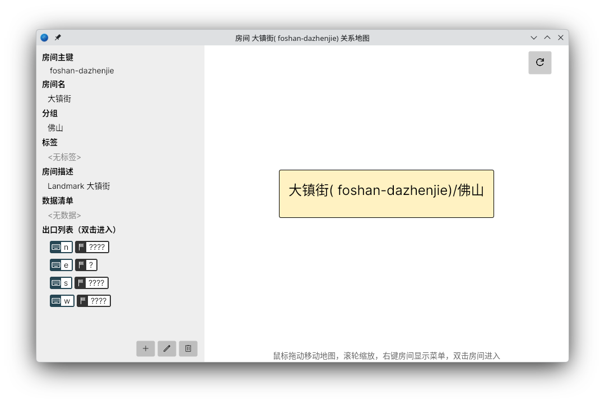

这时候我们会看见只有一个孤零零的房间。

我们开始以这个起点进行地图绘制。

我们在客户端里 n 一步，来到新房间 北门

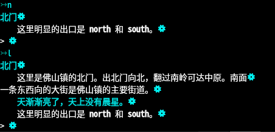

接着，回到HMM窗口，在关系地图界面点击新建按钮，会弹出一个同样的新建界面。

这时候我们输入

* 主键：foshan-beimen
* 名称：北门
* 分组：佛山
* 出口：
  * 目标 ???? 指令 n
  * 目标 foshan-dazhenjie 指令 s

很明显，由于我们知道 s 对应的是之前的房间，所以，可以直接在新建出口窗口里点击 目标右侧的 选取按钮，在选取窗口里选择 房间(或者你手输/复制粘贴也可以)：

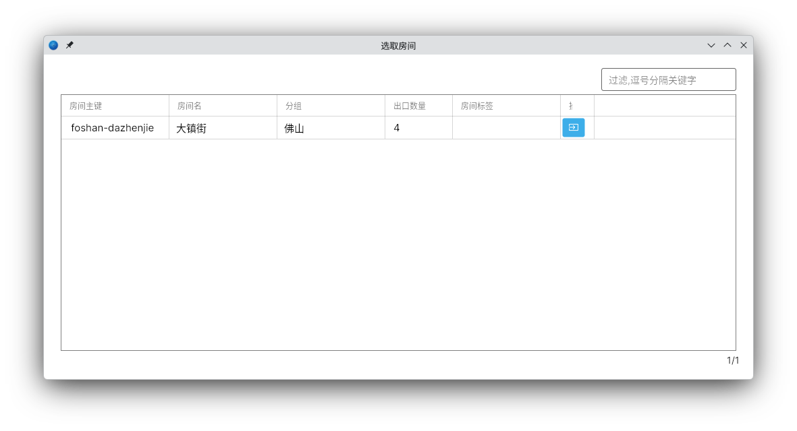

保存房间后，我们会发现关系地图进入了 我们新建的房间，而且和大镇街之间也有一个单向箭头

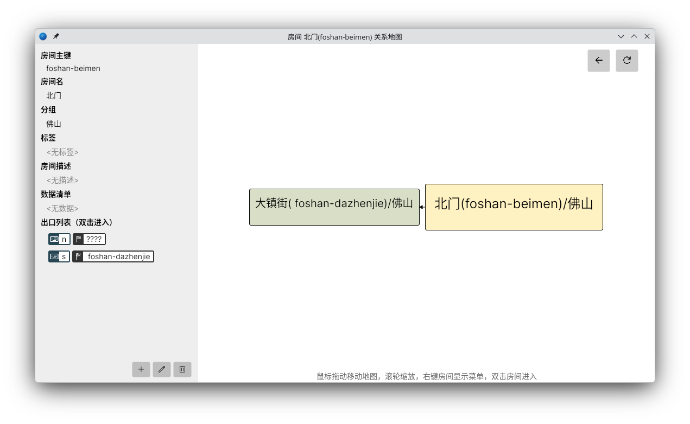

## 维护房间关系

我们现在有了两个房间了，接下去就要维护大镇街出口的消息。

这是我们可以点击地图右上方的返回按钮(或者双击出口列表里对应大镇街的那条)

回到大镇街，点击 左下方的编辑按钮，编辑n那个出口，指向北门

保存后，会发现关系地图里两个地图 有了双向箭头

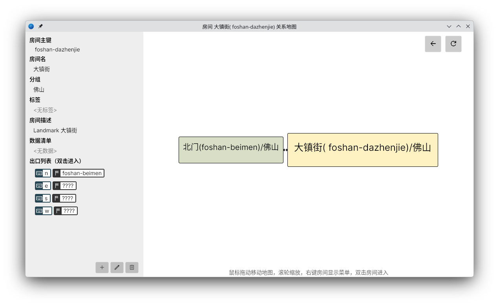

这时候双击那个不是????到foshan-beimen的n出口，或者双击地图上的 那个北门\(foshan-beimen\)/佛山的房间，关系地图就跳到北门了。

这时候我们发现，北门也变成双向连接了。


很好，干得好，下一步，就是继续把这个区域的房间都登记进去了。

这时候，可不用急着把所有出口都维护正确，这是下一步的工作。

## 全面检查出口关系

我们不停的重复上一步，很快，这个小镇的房间我们都画齐了。

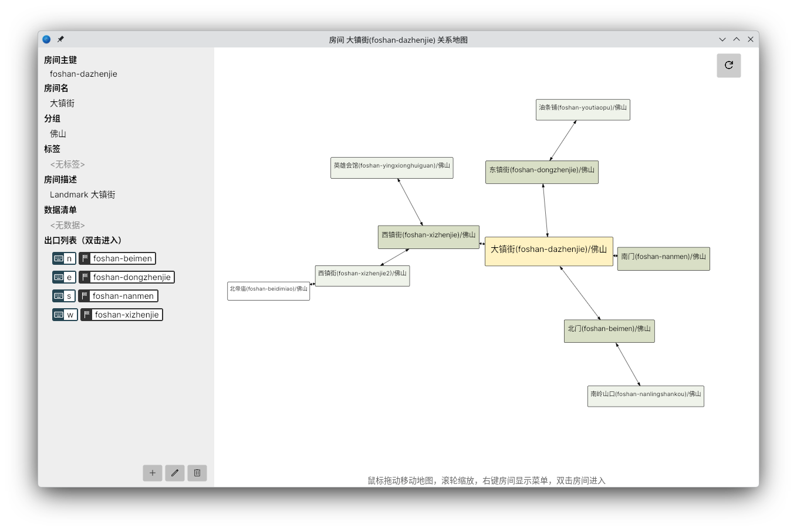

然后我们看下列表，霍，28个房间了

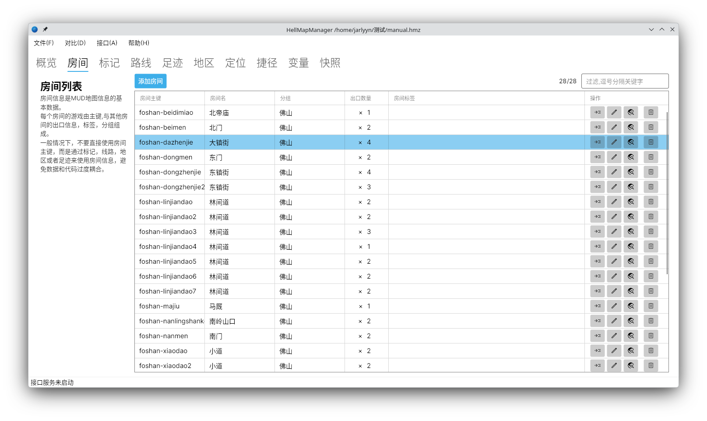

这时候我们开始继续了。

还记得我们之前用了很多????的出口吗？

然我们搜索下

```
佛山,????
```

用逗号分割2个关键字，就能找到佛山分组下所有未更新的出口了

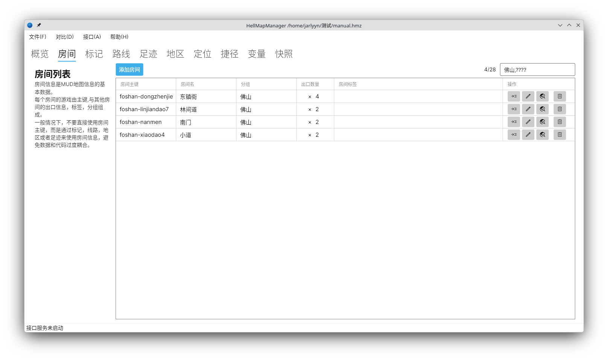

嗯，发现明显有问题，感觉把这些出口的修复正确。

## 更新定位

还记得我们之前加的Landmark描述么？

让我们在列表搜索

```
佛山,Landmark
```
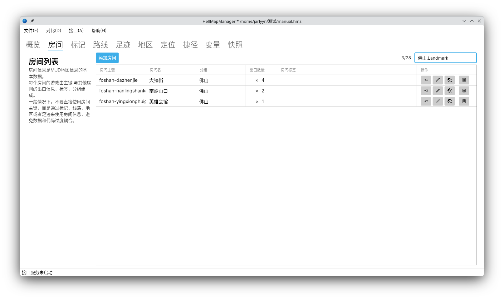

然后依次去那些房间核实是否适合做定位，可以的话，建立相应的定位。

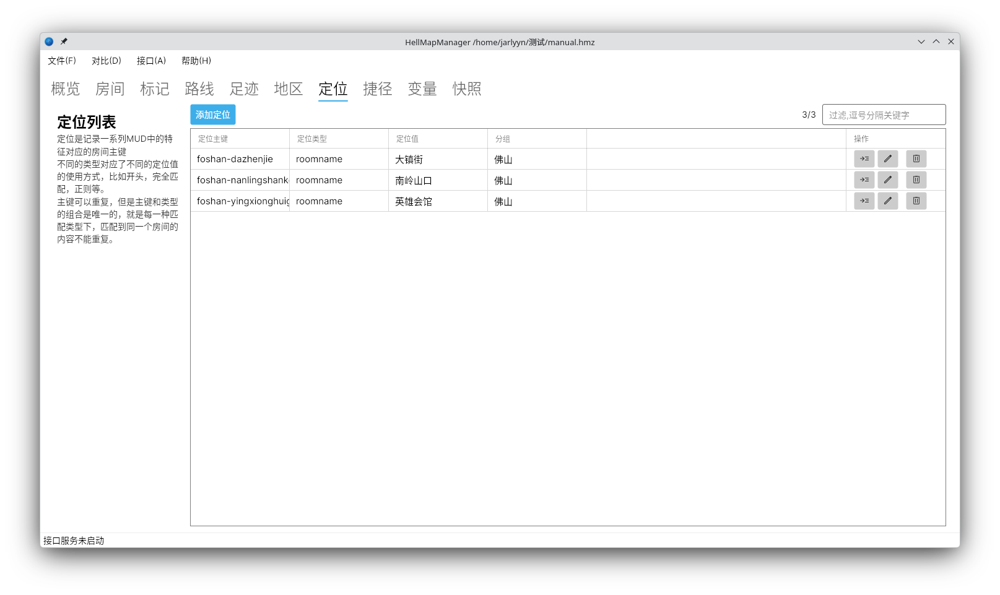

那样，只有你的机器有合适的代码，就能加载这些数据后进行相应的定位了。

## 使用数据

更新好数据，我们肯定想看下怎么使用。

使用可以通过hellmapmanager.ts项目提供的js和lua脚本，或者直接访问http接口方式进行。

让我们用最他通用的http方式调用数据看看

首先，让我们点击HMM接口窗口的启动。如果接口没被占用(比如其他HMM程序)，窗口最下方的**接口服务未启动**的信息，会变成 **接口服务正在监听8466端口**的信息：

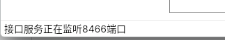

这时候我们就可以调用接口了。

我们可以执行这个指令

```
curl -X POST -d '{"From":["foshan-dazhenjie"],"Target":["foshan-linjiandao7"]}' http://127.0.0.1:8466/api/db/querypathany
```

正常情况下，就会得到以下结果

```json
{"From":"foshan-dazhenjie","To":"foshan-linjiandao7","Cost":9,"Steps":[{"Command":"e","Target":"foshan-dongzhenjie","Cost":1},{"Command":"e","Target":"foshan-dongzhenjie2","Cost":1},{"Command":"e","Target":"foshan-dongmen","Cost":1},{"Command":"e","Target":"foshan-linjiandao","Cost":1},{"Command":"e","Target":"foshan-linjiandao2","Cost":1},{"Command":"e","Target":"foshan-linjiandao3","Cost":1},{"Command":"ne","Target":"foshan-linjiandao5","Cost":1},{"Command":"ne","Target":"foshan-linjiandao6","Cost":1},{"Command":"ne","Target":"foshan-linjiandao7","Cost":1}],"Unvisited":[]}
```

这个数据，用json格式解析下，就能得到一个每一步带坐标，方便惯性导航的路径了。

## 更多完善

在确保了房间之间映射关系正常，有定位信息后，就应该通过代码对路径进行遍历更新了。

对于有特殊要求的房间，可以在出口上加入限制条件。

对于房间本身的信息，比如室外，安全等，可以通过SetTag设置。

各种描述，地图，npc等，可以抓取快照。

手动绘制的部分只是主干，通过代码同步更新的部分才是逐渐生产出来的血肉。